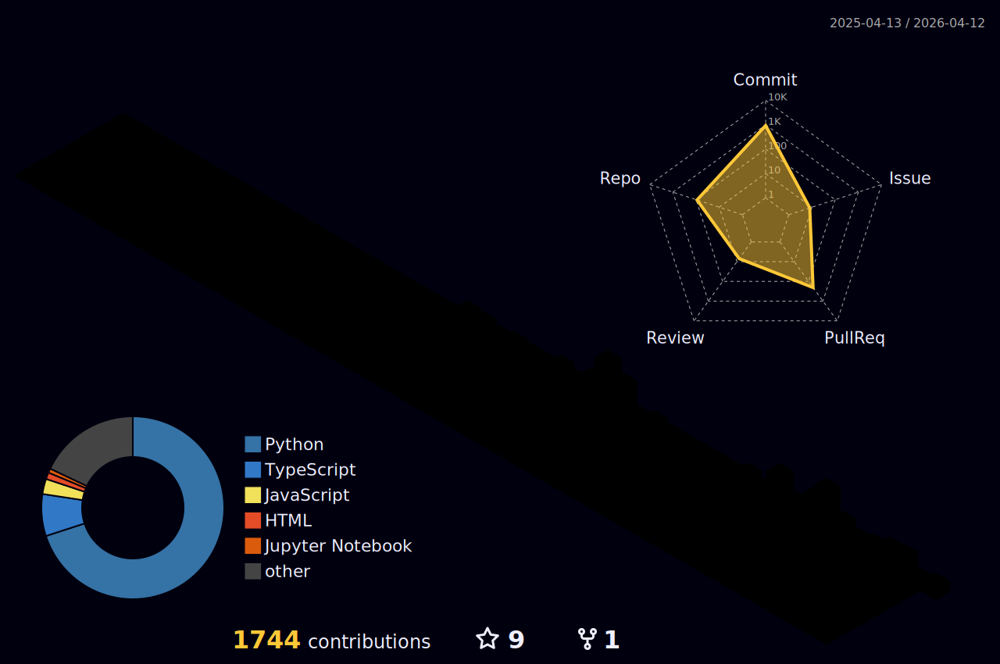

# Hi there, I'm Tyson Cung 👋

  
  
  
  
  

## ⚡ Quick Stats

  
  
  
  
  
  
  

## 🚀 About Me

I'm a **Cloud & Platform Engineering Lead** who builds intelligent, scalable systems at the intersection of **AI/ML, Cloud Architecture, Data Engineering, and DevOps**. I combine deep technical expertise across the full stack with a focus on production-grade solutions and automation.

- ☁️ **Cloud & Platform Engineering** - AWS, Azure, Kubernetes, Terraform, IaC
- 🤖 **AI/ML Systems** - LLMs, AI agents, MLOps, production ML pipelines
- 📊 **Data Engineering** - Data platforms, pipelines, analytics infrastructure
- 🔧 **DevOps & Automation** - CI/CD, GitOps, platform tooling, developer experience
- 💡 **Open Source** - Active contributor to cloud, AI, and DevOps ecosystems
- 🎯 **Focus**: Building intelligent platforms that scale and empower teams

<!-- STATS:START -->
## 📊 Current Stats
- 🔥 **13-day streak** achieved! (Sept 11-15, 17-25, 30, Oct 23)
- 📝 **145+ contributions** this year
- 🎯 **9 PRs** currently open (2 new PRs this week!)
- ✅ **36 PRs** merged across major projects
- 🏆 **322 public repositories** (+2 new projects!)
- 📚 **Daily learning** maintained with automation
- 👥 **28 followers** | **183 following**
- ⭐ **382+ stars** given (+10 new this session)
- 🚀 **Featured**: n8n-MCP-demo (workflow automation), awesome-ai-agents (curated list)
- 💡 **Latest**: Cross-platform n8n-MCP integration demo with Docker
<!-- STATS:END -->

## 🏅 Achievements & Badges

  

## 🛠️ Tech Stack

### Languages

### Cloud & Infrastructure

### AI/ML & Data

### DevOps & Tools

### Databases

## 📊 GitHub Stats

  
  

  

## 🏆 Featured Projects

### ☁️ Cloud & Platform Engineering
- **[Awesome DevOps Platform](https://github.com/tysoncung/awesome-devops-platform)** ⭐ - 200+ Platform Engineering & GitOps resources
- **[Awesome DevOps Tools](https://github.com/tysoncung/awesome-devops-tools)** - Curated collection of 400+ DevOps tools
- **[Awesome CDK TypeScript](https://github.com/tysoncung/awesome-cdk-typescript)** - 100+ AWS CDK TypeScript resources
- **[AWS Data Platform](https://github.com/tysoncung/aws-data-platform)** - Production-ready data platform template
- **[Azure Fabric Data Platform](https://github.com/tysoncung/azure-fabric-data-platform)** - Modern data platform with Microsoft Fabric

### 🤖 AI/ML & Intelligent Systems
- **[n8n-MCP Integration Demo](https://github.com/tysoncung/n8n-mcp-demo)** ⭐ NEW - Cross-platform n8n workflow automation with Model Context Protocol using Docker
- **[Awesome AI Agents](https://github.com/tysoncung/awesome-ai-agents)** ⭐ NEW - Curated list of 50+ AI agent frameworks and resources
- **[AI Stacks](https://github.com/tysoncung/ai-stacks)** - Comprehensive AI tools repository with 150+ categorized tools
- **[GitHub 10X Automation](in-repo)** - AI-powered GitHub productivity and engagement tools
- **[Crypto Chart Patterns](https://github.com/tysoncung/crypto-chart-patterns)** - ML pattern detection for technical analysis

### 📊 Data Engineering
- **[MongoDB Prisma Demo](https://github.com/tysoncung/mongodb-prisma-demo)** - Full-stack with Prisma ORM, migrations, and CI/CD
- **[Data Pipeline Templates](coming-soon)** - Production-ready data engineering patterns

### 🔧 Developer Tools & Automation
- **[Awesome Node.js Tools](https://github.com/tysoncung/awesome-nodejs-tools)** - Ranked Node.js packages with metrics
- **[Essential Eight Checklist](https://github.com/tysoncung/essential-eight-checklist)** - ACSC security maturity implementation
- **[Awesome Fedify](https://github.com/tysoncung/awesome-fedify)** - ActivityPub & fediverse resources

## 📈 Contribution Activity

  

### 📊 3D Contribution Calendar

  

### 🔄 Recent Activity
<!-- RECENT:START -->
- ⭐ Starred [3b1b/manim](https://github.com/3b1b/manim)
<!-- RECENT:END -->

## 🌟 Expertise Highlights

- ☁️ **Cloud Architecture**: Designing scalable, resilient systems on AWS and Azure
- 🏗️ **Platform Engineering**: Building Internal Developer Platforms (IDPs) and GitOps workflows
- 🤖 **AI/ML Integration**: Incorporating LLMs and ML into cloud-native applications
- 📊 **Data Engineering**: Designing robust data pipelines and analytics platforms
- 🔧 **DevOps Excellence**: CI/CD, infrastructure as code, automation at scale
- 📚 **Open Source**: Contributing to cloud, AI, DevOps, and platform engineering ecosystems

## 💡 Current Focus

- 🎯 **Platform Engineering** - Building comprehensive IDPs with GitOps and automation
- 🤖 **AI-Enhanced Systems** - Integrating LLMs into cloud platforms and workflows
- 📊 **Data Infrastructure** - Modern data platforms with real-time processing
- ☁️ **Multi-Cloud Strategy** - AWS, Azure, and hybrid cloud architectures
- 🚀 **Developer Experience** - Tools and platforms that 10x productivity
- 🔍 **Open Source** - Contributing to awesome lists, frameworks, and tooling

## 📫 Connect With Me

  

## 💖 Support My Work

  
  If you find my projects helpful, please consider:
  
  
  
  
  

---

  
  
  ### ⚡ Fun Fact
  *"The best way to predict the future is to invent it."* - Alan Kay
  
   
  
  **Let's connect and build something amazing together!** 🚀

<!-- Last updated: 2025-10-23 00:29:06 UTC -->
