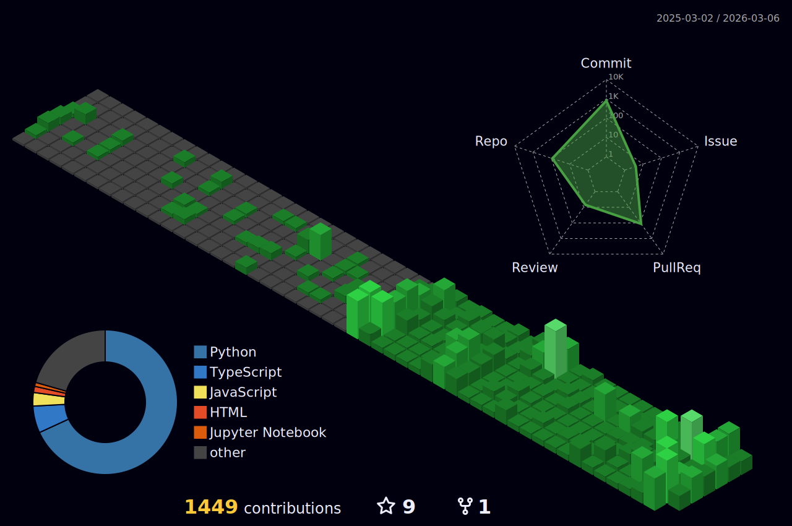

<div align="center">

<!-- HEADER -->


[](https://github.com/tysoncung)

<br/>

<!-- SOCIAL BADGES -->
<a href="https://github.com/tysoncung?tab=followers">
  
</a>


<br/><br/>

<a href="https://twitter.com/tscung"></a>
<a href="https://www.linkedin.com/in/tysoncung/"></a>
<a href="mailto:tyson@hivo.co"></a>

</div>

<br/>

<!-- ABOUT ME -->
## About Me

```python
class TysonCung:
    def __init__(self):
        self.role = "Chief Product Officer"
        self.company = "hivo.co"
        self.location = "Perth, Australia"
        self.education = "B.Sc Computer Science, NUS"

    @property
    def skills(self):
        return {
            "languages": ["Python", "TypeScript", "Go", "Rust"],
            "cloud": ["AWS (4x Certified)", "Kubernetes", "Docker", "Terraform"],
            "ai_ml": ["PyTorch", "LangChain", "RAG", "AI Agents"],
            "databases": ["PostgreSQL", "Redis", "Vector DBs"]
        }

    @property
    def open_source_impact(self):
        return "220,000+ stars on contributed projects"
```

---

<!-- SNAKE ANIMATION -->
<div align="center">

## Contribution Graph

<picture>
  <source media="(prefers-color-scheme: dark)" srcset="https://raw.githubusercontent.com/tysoncung/tysoncung/output/snake-dark.svg" />
  <source media="(prefers-color-scheme: light)" srcset="https://raw.githubusercontent.com/tysoncung/tysoncung/output/snake.svg" />
  
</picture>

</div>

---

## Open Source Impact

<div align="center">

### Contributor to mass-adopted projects with **220,000+ combined stars**

</div>

<table>
<tr>
<td width="50%">

| Project | Stars |
|---------|:-----:|
| [**awesome-nodejs**](https://github.com/sindresorhus/awesome-nodejs) |  |
| [**tldr-pages**](https://github.com/tldr-pages/tldr) |  |
| [**pandas**](https://github.com/pandas-dev/pandas) |  |
| [**awesome-readme**](https://github.com/matiassingers/awesome-readme) |  |
| [**ragas**](https://github.com/explodinggradients/ragas) |  |

</td>
<td width="50%">

| Project | Stars |
|---------|:-----:|
| [**stdlib-js**](https://github.com/stdlib-js/stdlib) |  |
| [**awesome-typescript**](https://github.com/dzharii/awesome-typescript) |  |
| [**ccusage**](https://github.com/ryoppippi/ccusage) |  |
| [**awesome-dynamodb**](https://github.com/alexdebrie/awesome-dynamodb) |  |
| [**fedify**](https://github.com/fedify-dev/fedify) |  |

</td>
</tr>
</table>

---

## Awesome Lists I Maintain

> Helping thousands of developers find the best tools

<div align="center">

| | List | Description |
|:--:|------|-------------|
|  | [**awesome-vibe-coding**](https://github.com/tysoncung/awesome-vibe-coding) | 100+ AI coding tools - Cursor, Copilot, Windsurf |
|  | [**awesome-ai-gadgets**](https://github.com/tysoncung/awesome-ai-gadgets) | CES 2026 AI wearables & hardware |
|  | [**awesome-claude-ai**](https://github.com/tysoncung/awesome-claude-ai) | Claude Opus 4.5 tools & resources |
|  | [**awesome-ai-agents**](https://github.com/tysoncung/awesome-ai-agents) | AI agent frameworks & browser automation |
|  | [**awesome-n8n**](https://github.com/tysoncung/awesome-n8n) | 380+ workflow automation resources |
|  | [**awesome-devops-tools**](https://github.com/tysoncung/awesome-devops-tools) | Modern DevOps toolchain |

**[View all 20+ awesome lists](https://github.com/tysoncung?tab=repositories&q=awesome)**

</div>

---

## GitHub Trophies

<div align="center">

[](https://github.com/ryo-ma/github-profile-trophy)

</div>

---

## Tech Stack

<div align=&cache=1770338260"center">

### Languages


### Cloud & DevOps


### AI/ML & Data


</div>

---

## GitHub Stats

<div align="center">


</div>

<details>
<summary><b>More Stats</b></summary>
<div align="center">


</div>
</details>

<details>
<summary><b>3D Contribution Graph</b></summary>
<div align="center">



</div>
</details>

---

## Support My Work

<div align="center">

If you find my open source work helpful, consider supporting me!

<a href="https://github.com/sponsors/tysoncung">
  
</a>
<a href="https://www.buymeacoffee.com/tysoncung">
  
</a>

</div>

---

<!-- QUOTE -->
<div align="center">

### Random Dev Quote


</div>

---

<!-- FOOTER -->
<div align="center">


**Perth, Australia** | B.Sc Computer Science, NUS | CPO at [hivo.co](https://hivo.co)

<sub>Last updated by GitHub Actions</sub>

</div>

<!-- Last updated: 2026-02-06 00:37:41 UTC -->
