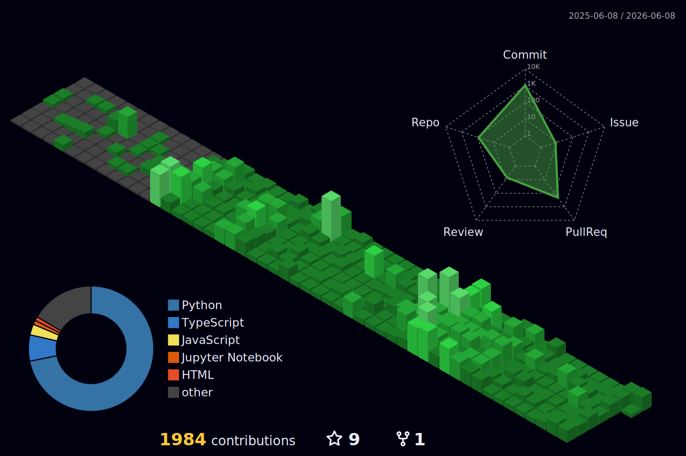

<div align="center">

<!-- HEADER -->


[](https://github.com/tysoncung)

<br/>

<!-- SOCIAL BADGES -->
<a href="https://github.com/tysoncung?tab=followers">
  
</a>


<br/><br/>

<a href="https://twitter.com/tscung"></a>
<a href="https://www.linkedin.com/in/tysoncung/"></a>
<a href="https://youtube.com/@tysoncung"></a>
<a href="https://dev.to/tyson_cung"></a>
<a href="https://tysoncung.gumroad.com"></a>
<a href="https://medium.com/@tysoncung"></a>
<a href="mailto:tyson@hivo.co"></a>

</div>

<br/>

<!-- ABOUT ME -->
## About Me

```python
class TysonCung:
    def __init__(self):
        self.role = "Chief Product Officer"
        self.company = "hivo.co"
        self.location = "Perth, Australia"
        self.education = ["M.Tech Software Engineering, NUS",
                           "CDAIO (Chief Data & AI Officer), NUS"]

    @property
    def skills(self):
        return {
            "languages": ["Python", "TypeScript", "Go", "Rust"],
            "cloud": ["AWS (4x Certified)", "Kubernetes", "Docker", "Terraform"],
            "ai_ml": ["PyTorch", "LangChain", "RAG", "AI Agents"],
            "databases": ["PostgreSQL", "Redis", "Vector DBs"]
        }

    @property
    def open_source_impact(self):
        return "600,000+ stars on contributed projects"
```

---

<!-- SNAKE ANIMATION -->
<div align="center">

## Contribution Graph

<picture>
  <source media="(prefers-color-scheme: dark)" srcset="https://raw.githubusercontent.com/tysoncung/tysoncung/output/snake-dark.svg" />
  <source media="(prefers-color-scheme: light)" srcset="https://raw.githubusercontent.com/tysoncung/tysoncung/output/snake.svg" />
  
</picture>

</div>

---

## Open Source Impact

<div align="center">

### Contributor to mass-adopted projects with **600,000+ combined stars**

</div>

<table>
<tr>
<td width="50%">

| Project | Stars |
|---------|:-----:|
| [**huggingface/transformers**](https://github.com/huggingface/transformers) |  |
| [**ollama**](https://github.com/ollama/ollama) |  |
| [**langchain**](https://github.com/langchain-ai/langchain) |  |
| [**dify**](https://github.com/langgenius/dify) |  |
| [**meilisearch**](https://github.com/meilisearch/meilisearch) |  |
| [**microsoft/autogen**](https://github.com/microsoft/autogen) |  |

</td>
<td width="50%">

| Project | Stars |
|---------|:-----:|
| [**streamlit**](https://github.com/streamlit/streamlit) |  |
| [**openai-python**](https://github.com/openai/openai-python) |  |
| [**awesome-nodejs**](https://github.com/sindresorhus/awesome-nodejs) |  |
| [**tldr-pages**](https://github.com/tldr-pages/tldr) |  |
| [**pandas**](https://github.com/pandas-dev/pandas) |  |
| [**directus**](https://github.com/directus/directus) |  |

</td>
</tr>
</table>

---

## Recent Activity

<div align="center">

### 🔥 Latest Contributions (March 2026)

</div>

- 🎯 **Storybook** - Fixed Vue3 reactive globals desync issue ([PR #34347](https://github.com/storybookjs/storybook/pull/34347))
- 🧪 **Optuna** - Added `__future__` annotations to pruners & terminator modules ([PR #6590](https://github.com/optuna/optuna/pull/6590))
- 🥋 **Kana Dojo** - Japanese learning platform contribution ([PR #10498](https://github.com/lingdojo/kana-dojo/pull/10498))
- ⚡ **OracleTrace** - Python performance regression tool ([PR #10](https://github.com/KaykCaputo/oracletrace/pull/10))
- 🎫 **TokenBound** - Event management & ticketing platform fixes ([PR #118](https://github.com/crowdpass-live/tokenbound_impl/pull/118), [PR #119](https://github.com/crowdpass-live/tokenbound_impl/pull/119))
- 🌾 **Amana** - Stellar blockchain escrow protocol ([PR #161](https://github.com/KingFRANKHOOD/Amana/pull/161))

---

## Awesome Lists I Maintain

> Helping thousands of developers find the best tools

<div align="center">

| | List | Description |
|:--:|------|-------------|
|  | [**awesome-vibe-coding**](https://github.com/tysoncung/awesome-vibe-coding) | 100+ AI coding tools - Cursor, Copilot, Windsurf |
|  | [**awesome-ai-gadgets**](https://github.com/tysoncung/awesome-ai-gadgets) | CES 2026 AI wearables & hardware |
|  | [**awesome-claude-ai**](https://github.com/tysoncung/awesome-claude-ai) | Claude Opus 4.5 tools & resources |
|  | [**awesome-ai-agents**](https://github.com/tysoncung/awesome-ai-agents) | AI agent frameworks & browser automation |
|  | [**awesome-n8n**](https://github.com/tysoncung/awesome-n8n) | 380+ workflow automation resources |
|  | [**awesome-devops-tools**](https://github.com/tysoncung/awesome-devops-tools) | Modern DevOps toolchain |

**[View all 20+ awesome lists](https://github.com/tysoncung?tab=repositories&q=awesome)**

</div>

---

## GitHub Trophies

<div align="center">

[](https://github.com/ryo-ma/github-profile-trophy)

</div>

---

## Tech Stack

<div align=&cache=1774658481"center">

### Languages


### Cloud & DevOps


### Frameworks & Tools


### AI/ML & Data


</div>

---

## GitHub Stats

<div align="center">


</div>

<details>
<summary><b>More Stats</b></summary>
<div align="center">


</div>
</details>

<details>
<summary><b>3D Contribution Graph</b></summary>
<div align="center">



</div>
</details>

---

## My Products

<div align="center">

| | Product | Description |
|:--:|---------|-------------|
| :robot: | [**AI Platform AWS**](https://github.com/tysoncung/ai-platform-aws) | Production AI platform — Gateway, SDK, RAG, Agents. 6 providers, 112+ tests. **Open Source** |
| :electric_plug: | [**MCP Server Starter Kit**](https://github.com/tysoncung/mcp-server-starter) | Production MCP servers with auth, rate limiting, 5 tools, dual transport. [**Free**](https://github.com/tysoncung/mcp-server-starter) / [**Pro $49**](https://tysoncung.gumroad.com/l/mcp-starter-pro) |
| :zap: | [**Serverless NestJS Starter Pro**](https://tysoncung.gumroad.com/l/serverless-nestjs-starter) | Production-ready NestJS + AWS Lambda + CDK. 4 auth modes, DynamoDB, SQS, WAF. **$49** |
| :gear: | [**DDD Microservices Starter Kit**](https://tysoncung.gumroad.com/l/dddmsk) | Clean Architecture + DDD + Azure. **$39** |
| :wrench: | [**zapit**](https://www.npmjs.com/package/@tysoncung/zapit) | Generate NestJS CRUD APIs from Zod schemas. **npm** |
| :bar_chart: | [**Schema Dashboard**](https://github.com/tysoncung/schema-dashboard) | Generate CRUD dashboards from Zod schemas. Free + Pro |
| :video_game: | [**GameOn**](https://github.com/tysoncung/gameon) | Pickup game coordinator — WhatsApp bot + web. Next.js + MongoDB + Twilio. **Open Source** |
| :clapper: | [**ShortFactory Kids**](https://github.com/tysoncung/shortfactory-kids) | AI educational Shorts generator for children. Gemini 2.0 + Imagen 3 + Cloud TTS. **Open Source** |
| :page_facing_up: | [**excel-zod**](https://github.com/tysoncung/excel-zod) | Type-safe Excel reading & writing with Zod schemas. **Open Source** |
| :sunny: | [**Solar Arbitrage**](https://solar-arbitrage-web.vercel.app/) | Smart EV charging for AU solar owners. Free MVP |
| :battery: | [**EV Solar Calc**](https://github.com/tysoncung/ev-solar-calc) | Battery payback calculator for AU solar + EV owners. Free |

</div>

---

## Writing

<div align="center">

<a href="https://tysoncung.gumroad.com"></a>

**Latest articles:**
- [A Grandmother Lost Her Home Because a Cop Trusted an Algorithm](https://dev.to/tyson_cung/a-grandmother-lost-her-home-because-a-cop-trusted-an-algorithm-210g)
- [Apple M5 Fusion Architecture Explained - Two Dies, One Chip, Infinite Possibilities](https://dev.to/tyson_cung/apple-m5-fusion-architecture-explained-two-dies-one-chip-infinite-possibilities-o9e)
- [Atlassian Fires 1,600 Engineers to Bet Everything on AI](https://dev.to/tyson_cung/atlassian-fires-1600-engineers-to-bet-everything-on-ai-the-new-playbook-2nnp)
- [GPT-5.4 Just Dropped — Here's Everything Developers Need to Know](https://dev.to/tyson_cung/gpt-54-just-dropped-heres-everything-developers-need-to-know-1eni)
- [I Built a Production MCP Server Kit — Here's What I Learned](https://dev.to/tyson_cung/i-built-a-production-mcp-server-kit-heres-what-i-learned-28km)
- [Deploy a Production AI Platform on AWS for $100/month](https://dev.to/tyson_cung/deploy-a-production-ai-platform-on-aws-for-100month-3jgn)
- [Cost Tracking, Auth & Production Hardening](https://dev.to/tyson_cung/cost-tracking-auth-production-hardening-65j)
- [How I built a production-ready serverless NestJS API on AWS](https://dev.to/tyson_cung/how-i-built-a-production-ready-serverless-nestjs-api-on-aws-and-open-sourced-it-5b29)

</div>

---

## Support My Work

<div align="center">

If you find my open source work helpful, consider supporting me!

<a href="https://github.com/sponsors/tysoncung">
  
</a>
<a href="https://www.buymeacoffee.com/tysoncung">
  
</a>

</div>

---

<!-- QUOTE -->
<div align="center">

### Random Dev Quote


</div>

---

<!-- FOOTER -->
<div align="center">


**Perth, Australia** | M.Tech Software Engineering, NUS | CDAIO Cert, NUS | CPO at [hivo.co](https://hivo.co)

<sub>Last updated by GitHub Actions</sub>

</div>

<!-- Last updated: 2026-03-28 07:00:00 UTC -->
