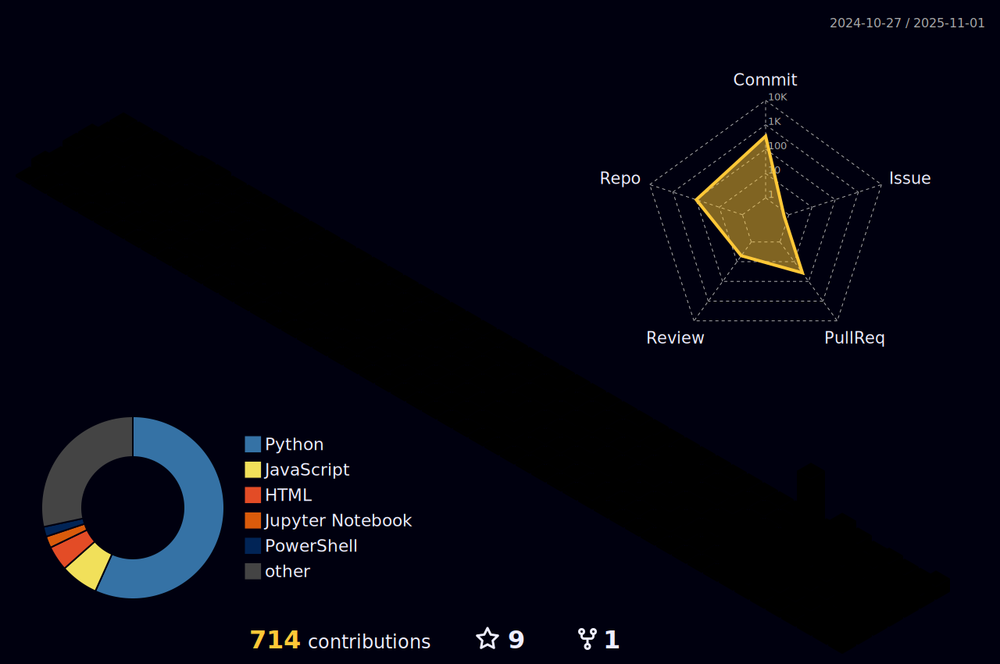

# Hi there, I'm Tyson Cung 👋

  
  
  
  
  

## ⚡ Quick Stats

  
  
  
  
  
  

## 🤖 About Me

I'm an **AI/ML Engineer** passionate about building intelligent systems that solve real-world problems. I specialize in LLMs, AI agents, and production ML systems, combining deep learning expertise with robust software engineering practices.

- 🔭 Currently working on **AI Agents & LLM Applications**
- 🤖 Building **AI-powered automation tools and intelligent systems**
- 🧠 Exploring **RAG, prompt engineering, and model fine-tuning**
- 💡 Active **Open Source Contributor** to AI/ML frameworks
- 🎯 Focus: **LLMs, MLOps, AI Agents, and Production AI Systems**
- 🚀 Contributing to **LangChain, Hugging Face, and AI tooling**

<!-- STATS:START -->
## 📊 Current Stats
- 🔥 **1-day streak** maintained!
- 📝 **8+ contributions** this year
- 🎯 **9 PRs** currently open
- ✅ **9 PRs** merged
- 🐛 **0 issues** opened
- 🏆 **319 public repositories**
- 📚 **Daily learning** maintained with automation
- 👥 **25 followers** | **181 following**
- ⭐ **356 stars** given
<!-- STATS:END -->

## 🏅 Achievements & Badges

  

## 🛠️ AI/ML Tech Stack

### AI/ML Frameworks & Libraries

### LLMs & AI Tools

### MLOps & Deployment

### Vector Databases & Tools

## 📊 GitHub Stats

  
  

  

## 🤖 Featured AI/ML Projects

### 🧠 LLM Applications
- **[AI GitHub Assistant](coming-soon)** ⭐ BUILDING - Autonomous GitHub agent powered by GPT-4
- **[RAG Document Chat](coming-soon)** - Chat with your documents using LangChain and vector embeddings
- **[AI Code Reviewer](coming-soon)** - Automated PR reviews with intelligent suggestions
- **[Prompt Engineering Toolkit](coming-soon)** - Collection of proven prompts and patterns

### 🚀 AI Tools & Resources
- **[Awesome AI Developer Tools](coming-soon)** ⭐ NEW - Curated list of 200+ AI tools for developers
- **[AI Stacks](https://github.com/tysoncung/ai-stacks)** - Comprehensive AI tools and resources repository with 150+ categorized tools
- **[LLM Experiments](coming-soon)** - Documenting experiments with various LLMs and techniques

### 🔬 ML/Deep Learning
- **[Model Zoo](coming-soon)** - Collection of trained models and datasets
- **[MLOps Pipeline](coming-soon)** - Production-ready ML deployment pipeline
- **[Crypto Chart Patterns](https://github.com/tysoncung/crypto-chart-patterns)** - Pattern detection algorithms for cryptocurrency technical analysis

### 🛠️ DevOps & Platform Tools
- **[Awesome DevOps Platform](https://github.com/tysoncung/awesome-devops-platform)** - 200+ Platform Engineering & GitOps resources
- **[Awesome DevOps Tools](https://github.com/tysoncung/awesome-devops-tools)** - Curated collection of 400+ DevOps tools
- **[GitHub 10X Automation](in-repo)** - Automated GitHub presence and productivity tools

## 📈 Contribution Activity

  

### 📊 3D Contribution Calendar

  

### 🔄 Recent Activity
<!-- RECENT:START -->
- ⭐ Starred [3b1b/manim](https://github.com/3b1b/manim)
<!-- RECENT:END -->

## 🌟 AI/ML Highlights

- 🤖 **LLM Applications**: Building production-ready apps with GPT-4, Claude, and open-source models
- 🧠 **AI Agents**: Developing autonomous agents with LangChain and custom frameworks
- 📚 **Knowledge Sharing**: Creating comprehensive AI/ML resources and tutorials
- 🤝 **Open Source**: Contributing to LangChain, Hugging Face, and AI tooling
- 🚀 **MLOps**: Deploying and monitoring ML models in production
- 🔬 **Research**: Experimenting with RAG, prompt engineering, and model fine-tuning

## 💡 Current AI Focus

- 🎯 Building **AI agents and autonomous systems** with LangChain
- 🧠 Exploring **RAG (Retrieval Augmented Generation)** for enterprise applications
- 🚀 Creating **AI-powered developer tools** and automation
- 🔍 Contributing to **AI/ML open source frameworks**
- 🛠️ Building **MLOps pipelines** for model deployment
- 📖 Sharing **AI/ML learnings** through code and documentation
- 🤖 Experimenting with **prompt engineering** and model optimization

## 📫 Connect With Me

  

## 💖 Support My Work

  
  If you find my projects helpful, please consider:
  
  
  
  
  

---

  
  
  ### ⚡ Fun Fact
  *"The best way to predict the future is to invent it."* - Alan Kay
  
   
  
  **Let's connect and build something amazing together!** 🚀

<!-- Last updated: 2025-10-21 09:44:52 UTC -->
