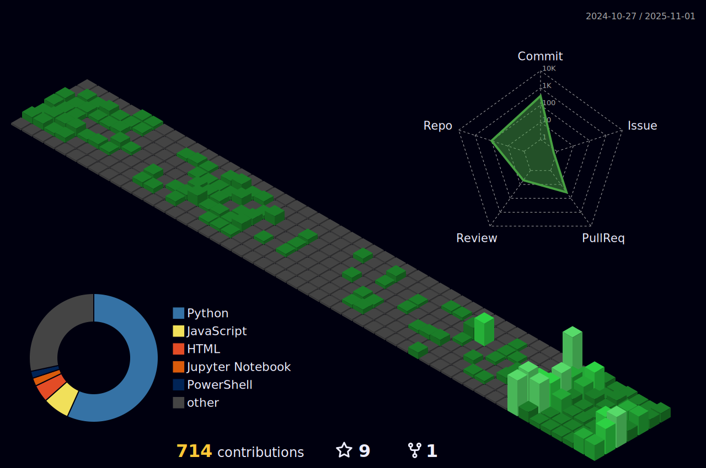

# Hey, I'm Tyson 

### CPO & AI Builder from Perth, Australia

---

## Open Source Impact

### Contributor to mass-adopted projects with **220,000+ combined stars**

| Project | Stars | Description |
|---------|:-----:|-------------|
| [**awesome-nodejs**](https://github.com/sindresorhus/awesome-nodejs) | 64K+ | The definitive Node.js resources list |
| [**tldr-pages**](https://github.com/tldr-pages/tldr) | 60K+ | Simplified, community-driven man pages |
| [**pandas**](https://github.com/pandas-dev/pandas) | 47K+ | Python data analysis library |
| [**awesome-readme**](https://github.com/matiassingers/awesome-readme) | 20K+ | README examples and inspiration |
| [**ragas**](https://github.com/explodinggradients/ragas) | 12K+ | LLM and RAG evaluation framework |
| [**stdlib-js**](https://github.com/stdlib-js/stdlib) | 5.6K+ | JavaScript/Node.js standard library |
| [**awesome-typescript**](https://github.com/dzharii/awesome-typescript) | 5K+ | TypeScript resources and tools |

<b>See all contributions</b>

| Project | Stars |
|---------|:-----:|
| [ccusage](https://github.com/ryoppippi/ccusage) | 9.7K+ |
| [awesome-dynamodb](https://github.com/alexdebrie/awesome-dynamodb) | 1.7K+ |
| [fedify](https://github.com/fedify-dev/fedify) | 900+ |

---

## Awesome Lists I Maintain

> Helping thousands of developers find the best tools

| List | Stars | Description |
|------|:-----:|-------------|
| [**awesome-vibe-coding**](https://github.com/tysoncung/awesome-vibe-coding) | 9 | 100+ AI coding tools - Cursor, Copilot, Windsurf |
| [**awesome-ai-gadgets**](https://github.com/tysoncung/awesome-ai-gadgets) | - | CES 2026 AI wearables & hardware |
| [**awesome-claude-ai**](https://github.com/tysoncung/awesome-claude-ai) | - | Claude Opus 4.5 tools & resources |
| [**awesome-ai-agents**](https://github.com/tysoncung/awesome-ai-agents) | - | AI agent frameworks & browser automation |
| [**awesome-n8n**](https://github.com/tysoncung/awesome-n8n) | - | 380+ workflow automation resources |
| [**awesome-devops-tools**](https://github.com/tysoncung/awesome-devops-tools) | 4 | Modern DevOps toolchain |

**[View all 20+ lists](https://github.com/tysoncung?tab=repositories&q=awesome)**

---

## GitHub Trophies

---

## Tech Stack

**AWS 4x Certified** | Building production AI/ML systems at [hivo.co](https://hivo.co)

---

## GitHub Stats

<b>3D Contribution Graph</b>

---

## What I'm Working On

- Building production AI systems at [hivo.co](https://hivo.co) as CPO
- Maintaining 20+ curated awesome lists for the developer community
- Exploring AI agents, RAG architectures, and MCP integrations
- Learning Rust and clinical data standards (FHIR, OMOP)

---

### Let's Connect!

I'm always happy to chat about AI systems, cloud infrastructure, or that one weird LLM hallucination that only happens in prod.

---

**Perth, Australia** | B.Sc Computer Science, NUS

If you find my work helpful, consider giving a star to my repos!

